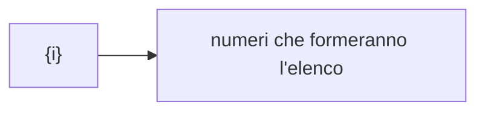
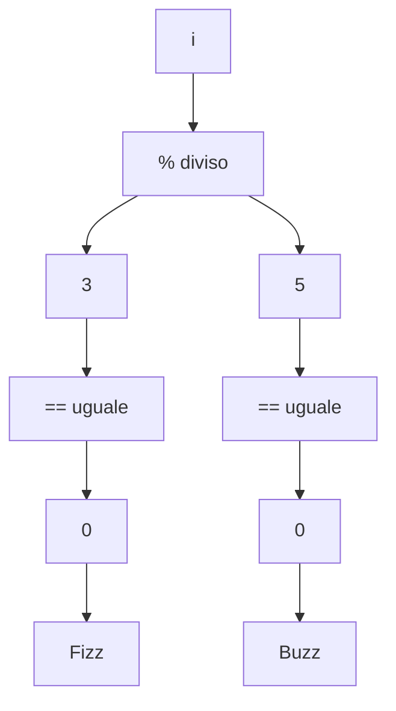

# FizzBuzz
## Descrizione
FizzBuzz è un applicazione che esegue una specifica nomeclatura di determinate numeri in base ad un semplice calcolo matematico:
I numeri divisibili per 3 saranno identificati col nome **Fizz**
I numeri divisibili per 5 saranno identificati col nome **Buzz**
I numeri divisibili per 15 saranno idetificati col nome **FizzBuzz**

## Funzionalità
Una volta laciata l'applicazione essa genererà una serie di numeri (da 0 a 100), per fare cio basta scrivere la seguente stringa:

```
for(int i = 0; i < 100; i++)
```

dopo di che apriamo le parentesi graffe { } ed inseriamo le stringhe di codici con le sequenze ed i calcoli che la nostra app eseguirà:
inseriamo ora il codice:

```
for(int i = 0; i < 100; i++){
    Console.Write($"Numero |{i}| \t");
```
inserendo il comadno **\t** andremo a creaze una tabulazione all'interno del nostro elenco


es: 1,2,3 ecc...

A questo punto vogliamo determinare una spericifica velocita nella realizzazione di questo elento, per fare ciò usiamo il comando:

```
     Thread.Sleep(200);
```
All'interno delle parentesi specifichiamo un valore che sarà codificato con la velocità di esecuzione del testo, in questo caso abbiamo inserito il valore **200** 

Ora possiamo inserire i codici che codificano i calcoli che la nostra app eseguira, calcoli utili per permettere alla stessa app di determinare se il numero sara nomeclato come Fizz, Buzz oppure FizzBuzz

```
if(i % 3 == 0) Console.Write($"Fizz");
if(i % 5 == 0) Console.Write($"Buzz");

```
Questa formula si traduce cosi:

    "if" (inteso come: "se" si verifica questa situazione)
    numero (i) diviso (%) 3 o 5, in questo caso, uguale (==) 0

dopo aver fatto questo breve calcolo l'applicazione ci rispondera con Fizz per i numeri divisi da 3. 
Buzz per i numeri divisi da 5.
Ed in automatico FizzBuzz per i numeri che sono sia divisibili per 3 che per 5
```
    Console.Write($Fizz)
    Console.Write($Buzz)
```
**N.B. con 0 non viene inteso un numero Reale quindi un risultato senza la virgola o numero decimale**    





